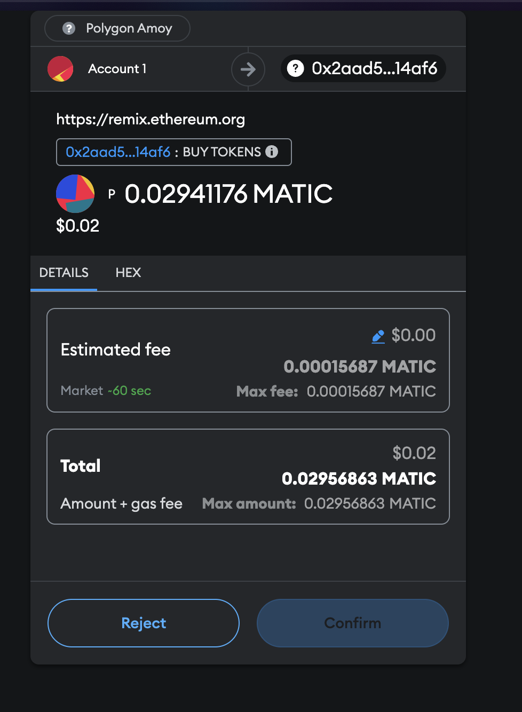
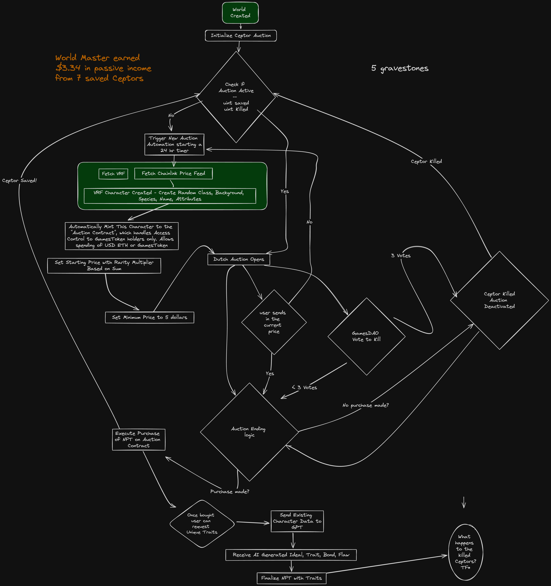

# Chainlink's Block Magic Games Team

> A Magic Spellbook of many Smart Contracts, and more to come!

1. Data Feeds leverage Chainlink's DON to get manipulation-resistant data (in our case, price of tokens in USD) from external providers. Games Team used Price Feeds in multiple contracts across different chains ([ZkSync](https://sepolia.explorer.zksync.io/address/0xA6bA847c70cB1eea5811f8C79632C09CF0478FCA#contract), Ethereum, Polygon).
1. VRF 2.5 Subscriptions to create a 1-click Random Character, at first 2-clicks because of callback limits.
1. Chainlink Functions twice! First to take the on-chain character information and give it to GPT to generate unique traits, flaws, bonds, and ideals for our random characters. Save it onchain, and then pass all that to GPT again, and get a prompt "alt-text" to generate a character art via human or ai artist.
1. Automation to upkeep the daily random character spawning in each World to generate income for Gamemaster and World Owners. This way there's always a character available to buy for quick starting.

# Games Contracts
1. [ZKSecrets](ZKSecretCharacter.sol) - Blockchains aren't good at saving secrets, until we unlock that with Zero Knowledge Technology of next generation chains, like zkSync! Deployed and verified on https://sepolia.explorer.zksync.io/address/0xA6bA847c70cB1eea5811f8C79632C09CF0478FCA#contract :D Uses **Chainlink Price Feeds** to let users save 5 bytes32 proofs in there for a fixed USD amount! Next steps would be having public values, and when VRF comes to zkSync, use that for randomness!  

2. [Game World Generator](BuyMeACeptor.sol) - A contract that generates a game world based on a user's vibe and number of players. The world is generated with a visual of the planet, scenarios, locations, descriptions, maps, denizens, secrets, goals, and players. Each world has its own blockchain. Creating a World costs 10 gameTokens.  when creating a game, i want to have my own world or play with others. each world should be locked to a blockchain. 10 gT to make a world. 5 gT to join one as a GM, 2 gT to join as player.

Inside worlds, there are games
inside games there are schedules
inside schedules there are sessions
(and we verify who shows up)

3. [Character Generator](Characters/CharacterGen.sol) - A contract that generates a character for a user in the game world. The character is generated with abilities, class, name, alignment, and background. Each character has its own unique attributes. Currently it uses VRF2.5, and provides a reroll (4d4 drop lowest) as well as a swap scores. It refers to the classes, backgrounds, and names contracts.  These contracts will eventually have their own Chainlink Functions call to GPT if the user rolls a length+1, it calls that function and triggers the Chainlink Functions call through the gateway, the prompt being to take the existing information about the character and the D&D 5e open source rules for homebrewing a name, class, or background. That's after the Auction House (see the flow chart below).

- Polygon Amoy: 0x3A5a60bc87170AeC94e5DbFA1E7FC1395CE78bB0

4. [GamesToken ERC20](GamesToken.sol) - A contract that is an ERC20 token that is used to pay for the creation of a world, and to pay for the creation of a game. Also can be spent to buy a random character from the portal. The OZ Access Control and Chainlink Price Feeds in the GamesDAOv3 is what lets us control who buys this token and for how much.

- Polygon Amoy 0xB8E927a25b2ab5d85ff79698cE11F2872d6Faf6b
- Ethereum Sepolia 
- Scroll
- zkSync

</a>

5. [GamesDAOv3](GamesDAOv3.sol) - Inspired by TokenShop from the Bootcamp.  A contract that has a ledger of allowed players, gamemasters, and tracks + mints the ERC20 Games Token for Chainlink Price Feeds = $20 USD (or two cents, $0.02, for testing). It also allows a gamemaster to propose a new price for the token, and all allowed players and gamemasters to vote on the price. if you are a player and gamemaster, you get 2 votes, i hope!

- Polygon Amoy 0x2aad5711Dfb60B8d8e4A5F6AF882a3275e814af6
- Ethereum Sepolia
- Scroll
- zkSync

### Random notes

1. Is this finished? No, tons left to do including connecting all the contracts together and adding the Ceptor Auction with automation. 

1. Is the World Generator deploying a World contract? Yes. Is the World contract tracking all its games, or deploying each game as its own contract which tracks the sessions. Verifiable Truth.

1. NPC Generator - Unlike the PCG which is usable by any Verified Credential having hooty in their hey hey. The NPCG is a contract that generates a non-player character for a user in the game world. The character is generated with abilities, class, name, alignment, hometown, and background. Each character has its own unique attributes. Creating a Character is only allowed by the owner of the contract.  VRF2.5 because reusable code choices.

1. Auction Price Machine -- Like a Dutch Auction, but with a price multiplier based on the rarity tier (total sum of the 6 ability scores in 5 tiers: minimum being 3*6 and maximum being 18*6)

Links for Auction & NFT references:
https://github.com/smartcontractkit/chainlink-automation-templates/tree/main/batch-nft-reveal
https://github.com/solangegueiros/chainlink-bootcamp-2024/tree/main

## Flowcharts



## Improvements
In our voting mechanism, I track both votesFor and votesAgainst. Consider using a single integer where a positive value increases for a “for” vote and decreases for an “against”. This reduces the storage operations:

```solidity
mapping(address => bool) public hasVoted;

function vote(bool voteFor) external onlyAllowed {
    require(!hasVoted[msg.sender], "Already voted");
    hasVoted[msg.sender] = true;

    proposal.voteCount += voteFor ? 1 : -1;
    emit Voted(msg.sender, voteFor);
}
```

Consider if I can use smaller type sizes and pack the struct better...

```solidity
struct Proposal {
        ProposalType proposalType;
        string catchphrase;
        uint32 newPrice; // could these be uint64?
        uint32 amount; // could these be uint64?
        uint32 votesFor; // could these be uint64?
        uint32 votesAgainst; // could these be uint64? 
        uint256 deadline;
        bool executed;
        mapping(address => bool) voters;
    }
    ```